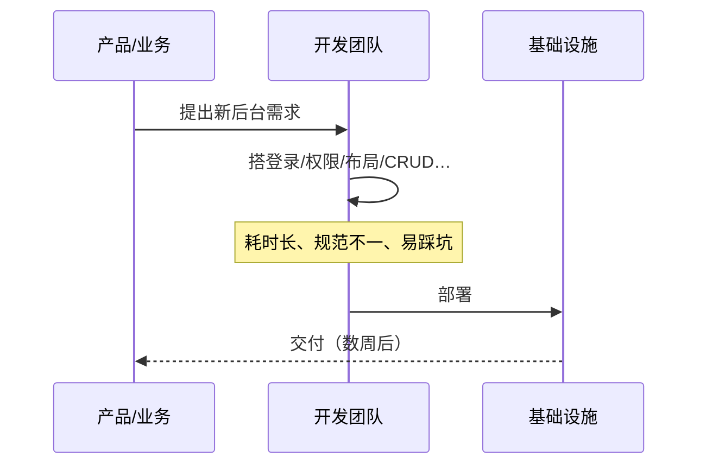
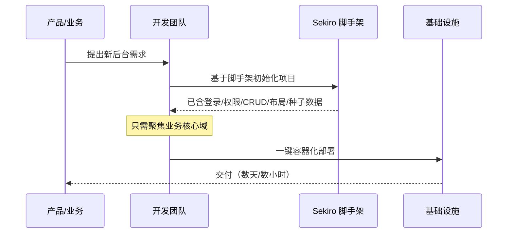
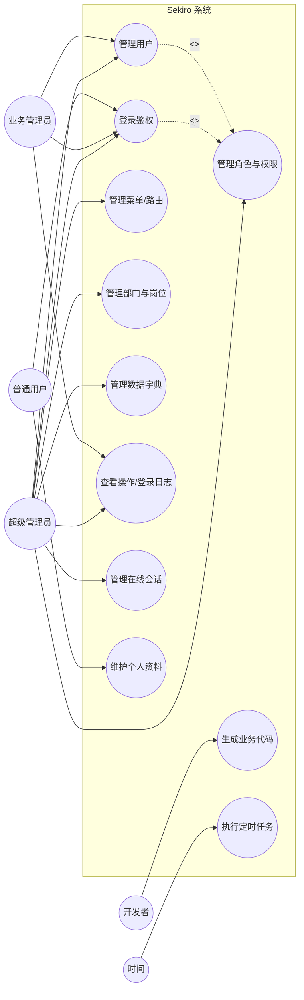
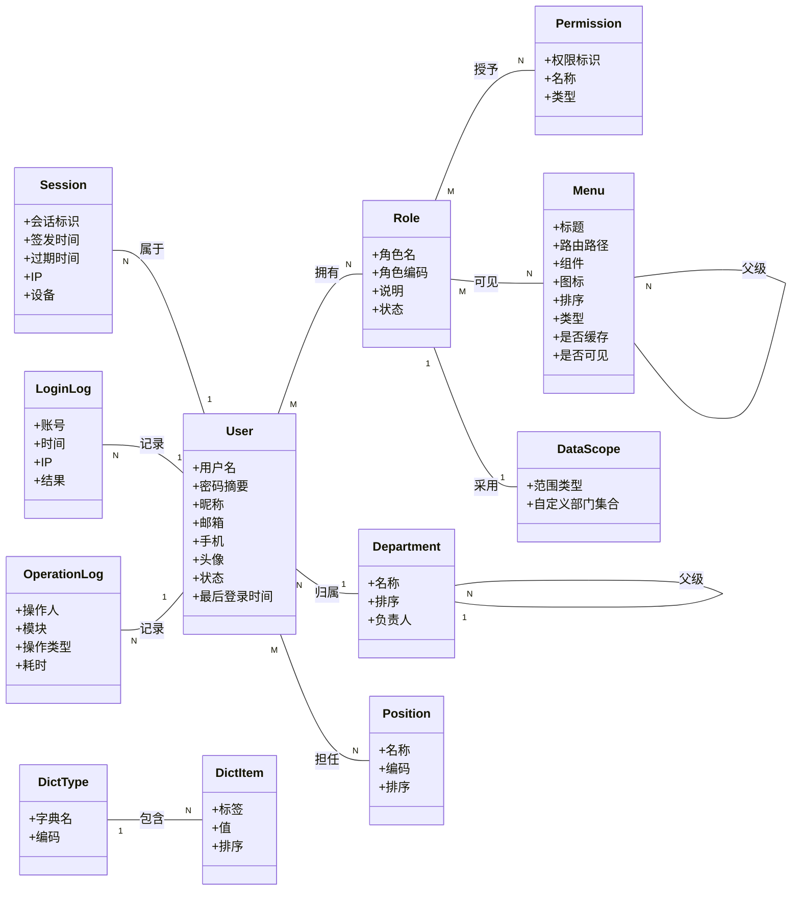
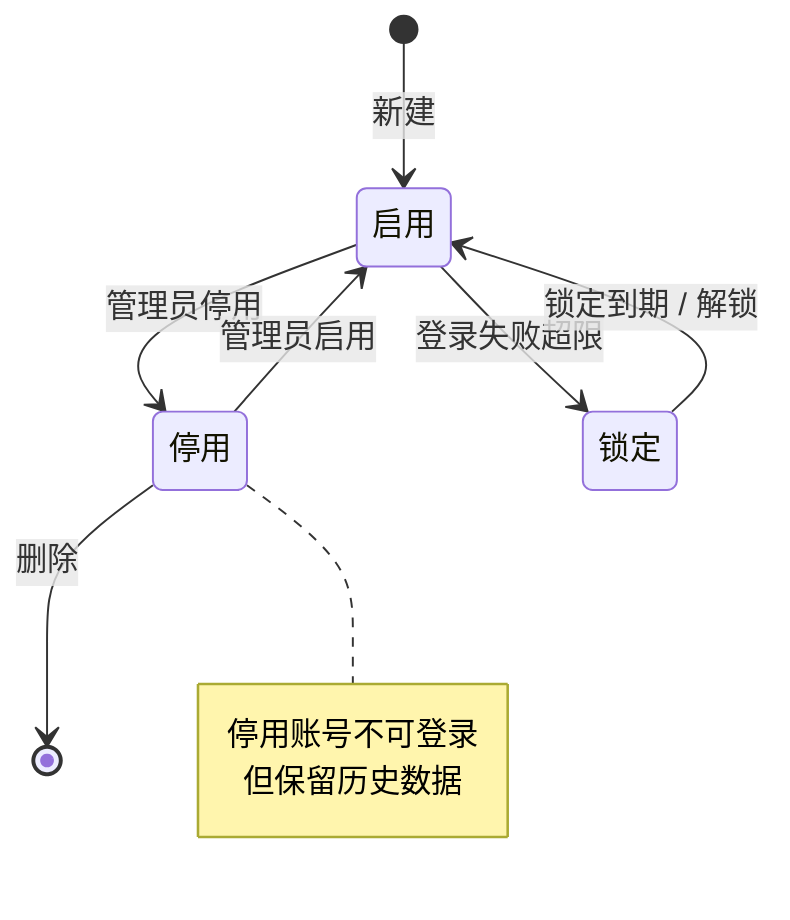
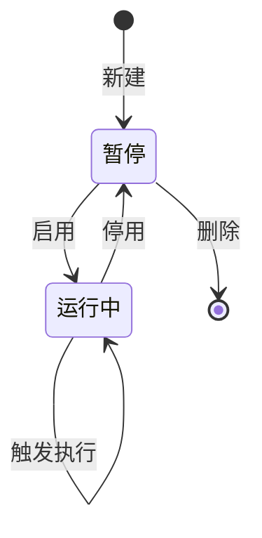
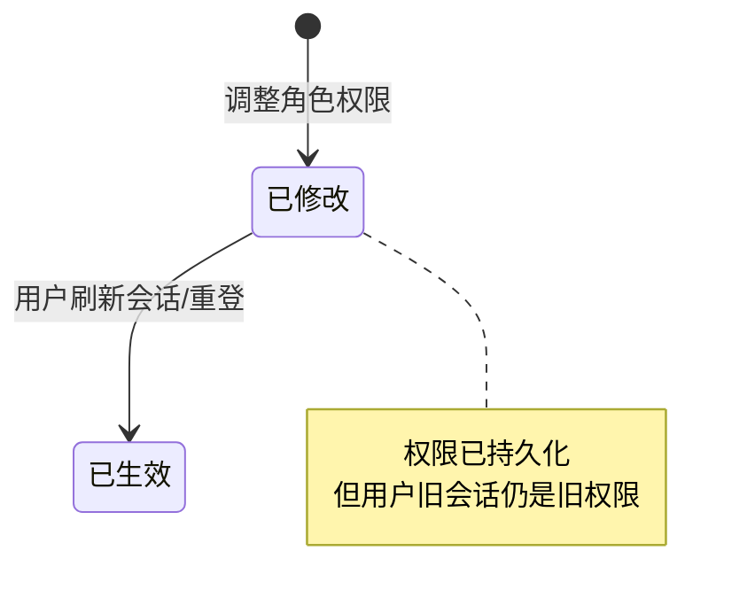

# 领域建模分析文档（Domain Analysis）

> **项目**：Sekiro —— 带管理后台的脚手架
> **方法论依据**：潘加宇《软件方法》（上册：业务建模与需求；下册：分析与设计）
> **文档版本**：v1.0
> **创建日期**：2026-07-04
> **输入文档**：`FEATURES.md`、`PRD.md`

---

## 修订记录

| 版本 | 日期 | 修订人 | 说明 |
| :-: | :-: | :-: | :-: |
| v1.0 | 2026-07-04 | — | 初版，完成业务建模、用例分析、领域模型三件套 |

---

## 0. 方法论与工作流说明

潘加宇《软件方法》强调：**建模是一项有顺序的脑力活动，不能跳步、不能倒置**。本分析严格遵循其四段式工作流：

```
 业务建模   ──►   需求   ──►   分析   ──►   设计
(Business       (Requirement   (Analysis      (Design
 Modeling)       /Use Case)     /Domain)       /Mapping)
```

| 阶段 | 回答的问题 | 产出物 | 与"想直接画类图"的区别 |
| :-: | --- | --- | --- |
| **业务建模** | 系统为谁、为什么而存在？在组织价值链中扮演什么角色？ | 业务流程序列图 | 不假设"系统已存在"，先看业务全貌 |
| **需求（用例）** | 系统**对外**承诺提供哪些有价值的"服务"？ | 用例图、用例规约 | 用例不是功能分解，而是外部视角的"价值" |
| **分析（领域模型）** | 问题域里有哪些稳定的概念、它们如何协作？ | 领域类图（与实现无关） | 类不是数据库表，名词才可能是类 |
| **设计** | 分析模型如何落地到具体技术栈？ | 架构、数据库、API | 后置，不污染分析模型 |

**三条"红线"**（贯穿全文）：
1. ⚠️ **领域模型里禁止出现实现概念**：不得出现 `Service`、`Repository`、`Controller`、`DTO`、`Table`、`@Entity` 等。
2. ⚠️ **动词不是类**：如"登录"是行为不是类，"登录日志"才是类；"授权"是行为，"权限授予"才是类（或关联）。
3. ⚠️ **先识别核心域**：脚手架类项目最易犯的错是把所有模块一视同仁，导致模型臃肿、主次不分。

---

## 1. 业务建模（Business Modeling）

> 目的：理解 Sekiro 服务于哪个"组织"，在该组织创造价值的过程中承担什么职责。

### 1.1 组织与愿景

潘老师要求先定位"我们要改进的组织"。Sekiro 的组织不是某个最终业务公司，而是**使用它来交付系统的软件研发组织（开发团队 / ISV / 企业 IT 部门）**。

- **组织**：交付中后台软件产品的研发团队
- **组织的痛点**：每个新项目都要重复搭建登录、权限、CRUD、布局等基础能力，重复劳动占比高达 60%–80%，交付慢、质量参差、规范不统一。
- **改进目标**：把"基础能力建设"从 N 次重复降为 1 次沉淀，使团队专注于**业务核心域**。

### 1.2 价值链与系统定位

研发组织的粗略价值链：

```
市场/客户需求 → 方案设计 → 【开发实现】 → 测试 → 部署 → 运维 → 交付
                                  ▲
                          Sekiro 在此注入价值
```

Sekiro 不直接面向最终业务用户，而是作为**研发提效的内部生产力工具（半成品）**，其"客户"是开发团队，其"最终受益者"是业务系统的使用者。这一点决定了它的核心域是**通用管理能力的沉淀与复用**，而非某个具体业务。

### 1.3 业务流程（现状 vs 目标）

以"立项一个新后台系统"为例，用序列图刻画 Sekiro 引入前后的差异。

**引入前**（每个项目重复造轮子）：



**引入后**（Sekiro 作为承载基础能力的"系统"）：



> 📌 **潘老师要点**：业务建模阶段刻意"假装系统还不存在"，先看清 Sekiro 在流程中**替代了哪段人工劳动**（替换了"重复搭建基础能力"这一段），从而明确系统价值边界。

---

## 2. 需求：用例分析（Use Case Analysis）

### 2.1 系统边界与执行者（Actor）

站在**外部视角**问："谁会通过 Sekiro 得到价值？"

| 执行者 | 类型 | 说明 |
| --- | --- | --- |
| **超级管理员** | 人，主要执行者 | 配置系统、管理用户与权限 |
| **业务管理员** | 人，主要执行者 | 管理其职责范围内的数据 |
| **普通用户** | 人，主要执行者 | 使用后台功能、维护个人资料 |
| **开发者**（外部，元层面） | 人，次要执行者 | 通过代码生成器/配置扩展系统（注意：这是脚手架特有的执行者） |
| **时间** | 非人执行者 | 触发定时任务、Token 过期 |
| **第三方身份系统** | 非人执行者 | OAuth/SSO 登录时被调用 |

> ⚠️ 潘老师提醒：用例的执行者必须是"能得到价值"的"外部"。**"数据库""Redis""日志系统"不是执行者**（它们是被系统使用的资源）。

### 2.2 用例图



### 2.3 用例分级（识别核心域的依据）

潘老师强调：**用例没有"大小"，但有"价值高低"**。按对组织目标的贡献分级：

| 分级 | 用例 | 说明 |
| :-: | --- | --- |
| 🟥 **核心用例** | 管理用户、管理角色与权限、管理菜单/路由 | 直接构成"管理后台"的核心价值，决定系统能否成立 |
| 🟧 **支撑用例** | 登录鉴权、管理部门与岗位、管理数据字典、管理在线会话 | 让核心用例可用、可治理 |
| 🟨 **外围用例** | 查看日志、生成业务代码、执行定时任务、维护个人资料 | 提升体验与可运维性 |

> 对应到**域的划分**：🟥=核心域，🟧=支撑域，🟨+认证细节=通用域。详见 §3.1。

### 2.4 关键用例规约（规约是领域模型的"原料"）

> 潘老师方法论的核心：**领域类不是凭空想的，而是从用例规约里"榨"出来的**。下面给出三个最有代表性的用例规约。

#### 用例规约 UC-3：管理角色与权限

- **主执行者**：超级管理员
- **前置条件**：执行者已登录且具备"角色管理"权限
- **主路径（成功场景）**：
  1. 执行者请求查看角色列表
  2. 系统**返回**所有角色及其绑定的权限
  3. 执行者**选择**一个角色，请求编辑其权限
  4. 系统**返回**该角色当前拥有的菜单/权限项（树形）
  5. 执行者**勾选/取消勾选**若干菜单与按钮权限
  6. 执行者提交
  7. 系统**保存**角色与权限的授予关系，**记录**一条操作日志
  8. 系统**返回**成功
- **扩展路径**：
  - 3a. 角色不存在 → 返回 404
  - 7a. 角色被他人停用 → 提示并阻止
  - 7b. 权限项已失效 → 过滤后保存
- **后置条件**：该角色下的所有用户在下次会话（或刷新）后权限随之变化

> 🔍 **榨取线索**（名词→候选类，动词→行为/关联）：
> "角色"、"权限"、"菜单"、"按钮权限"、"授予关系"、"操作日志"、"用户"。

#### 用例规约 UC-2：管理用户

- **主执行者**：超级管理员 / 业务管理员（受数据权限约束）
- **主路径**：
  1. 执行者按条件**查询**用户列表
  2. 系统**返回**用户及其所属部门、所任岗位、所拥有角色
  3. 执行者**新增/编辑**一个用户（含基本信息）
  4. 系统**校验**用户名唯一性
  5. 执行者**分配**角色（一个或多个）
  6. 执行者提交
  7. 系统**保存**用户及其角色授予，**置**初始状态为"启用"，**记录**操作日志
- **扩展路径**：
  - 1a. 业务管理员仅能看到其数据权限范围内的用户
  - 4a. 用户名重复 → 返回字段级错误
- **后置条件**：新用户可凭初始密码登录（如启用）

> 🔍 **榨取线索**："用户"、"部门"、"岗位"、"角色"、"状态"。

#### 用例规约 UC-1：登录鉴权

- **主执行者**：所有人员执行者
- **主路径**：
  1. 执行者**提交**账号与密码
  2. 系统**校验**账号存在、密码匹配、状态为"启用"
  3. 系统**签发**访问令牌与会话
  4. 系统**记录**一条登录日志（成功）
  5. 系统**返回**令牌与用户基本信息
- **扩展路径**：
  - 2a. 密码错误 → 记录失败登录日志，提示
  - 2b. 账号停用 → 拒绝登录
  - 2c. 失败次数超阈值 → 临时锁定
- **后置条件**：执行者持有有效令牌，可访问受权资源

> 🔍 **榨取线索**："令牌/会话"、"登录日志"、"账号"、"状态"。注意"登录"本身是行为，**不是类**。

---

## 3. 分析：领域模型（Domain Model）

> 这是本节核心。潘老师的方法：从 §2.4 的用例规约中提取**名词**得到候选类，**量词/形容词**得到属性，**连接两个类的动词**得到关联。然后剔除伪类、补足遗漏。

### 3.1 识别核心域

| 域 | 概念集合 | 在系统中的角色 |
| :-: | --- | --- |
| 🟥 **核心域：组织与权限治理** | 用户、角色、权限、菜单、部门、岗位、数据权限规则 | 直接承载"管理后台"的核心价值 |
| 🟧 **支撑域：系统运营** | 字典、系统参数、消息模板、文件资产 | 让核心域可被治理、可被复用 |
| 🟨 **通用域：认证与可观测** | 会话、登录日志、操作日志、定时任务 | 跨项目通用，可替换为外部组件 |

> ⚠️ **脚手架类项目的陷阱**：很容易把所有模块都当核心，导致模型臃肿。明确以"**组织与权限治理**"为核心域，其余围绕它服务。

### 3.2 候选类的提取（名词法）

从所有用例规约与 PRD 中收集名词，过"三道筛子"：

| 筛子 | 规则 | 例子（剔除） |
| :-: | --- | --- |
| ① 系统外 | 不属于系统职责范围 | "浏览器""开发者本人" |
| ② 实现概念 | 属于设计而非分析 | "数据库表""前端路由""DTO" |
| ③ 动词/行为 | 不是名词性概念 | "登录""授权""查询" |

**通过筛子的候选类**：

| 候选类 | 出处 | 是否成类 | 备注 |
| --- | --- | :-: | --- |
| 用户 User | UC-1/2 | ✅ | 核心 |
| 角色 Role | UC-2/3 | ✅ | 核心 |
| 权限 Permission | UC-3 | ✅ | 核心（按钮级权限项） |
| 菜单 Menu | UC-3/4 | ✅ | 核心（含目录/菜单/按钮三态） |
| 部门 Department | UC-2 | ✅ | 核心（树形） |
| 岗位 Position | UC-2 | ✅ | 核心 |
| 数据权限规则 DataScope | UC-2 扩展 | ✅ | 角色→数据范围 |
| 字典类型 DictType / 字典项 DictItem | F-CONF-02 | ✅ | 支撑 |
| 系统参数 Config | F-CONF-03 | ✅ | 支撑 |
| 文件资产 FileAsset | F-COMP-05 | ✅ | 支撑 |
| 会话 Session | UC-1 | ✅ | 通用（含在线用户） |
| 登录日志 LoginLog | UC-1 | ✅ | 通用 |
| 操作日志 OperationLog | UC-2/3 | ✅ | 通用 |
| 定时任务 ScheduledJob | F-LOG-07 | ✅ | 通用 |
| 令牌 Token | UC-1 | ❌ | 会话的载体，归入 Session 的属性/实现 |
| "登录" | UC-1 | ❌ | 动词，不是类 |
| "用户角色" | UC-2 | ❌ | 关联，不是独立类（除非要带属性） |

> 📌 **潘老师要点**：是否为"关联类"——只有当多对多关系**自身需要携带属性**（如"用户A在角色B下何时被授予、由谁授予"）时，才升级为类。这里 `用户-角色`、`角色-权限` 当前不带属性，故建模为**关联**，不建模为类。

### 3.3 属性的提取（从规约与字段需求）

> 属性同样从规约"榨"出，而非凭空补字段。下表只列关键属性，省略纯技术字段（如 `id`/`createdAt`）。

| 类 | 关键属性 | 来源 |
| --- | --- | --- |
| **User** | 用户名、密码摘要、昵称、邮箱、手机、头像、状态(启用/停用)、最后登录时间 | UC-1/2、PRD §4.2 |
| **Role** | 角色名、角色编码、说明、状态、数据范围 | UC-3、F-USER-06 |
| **Permission** | 权限标识(如 `user:create`)、名称、类型(菜单/按钮) | UC-3 |
| **Menu** | 标题、路由路径、组件、图标、排序、类型(目录/菜单/按钮)、是否缓存、是否可见、父级 | UC-4、PRD §4.2 |
| **Department** | 名称、排序、父级、负责人 | UC-5（树形自关联） |
| **Position** | 名称、编码、排序 | F-USER-08 |
| **DataScope** | 范围类型(全部/本部门/本部门及以下/仅本人/自定义)、自定义部门集合 | F-USER-06 |
| **DictType** | 字典名、编码 | F-CONF-02 |
| **DictItem** | 标签、值、排序、是否启用 | F-CONF-02 |
| **Config** | 参数键、参数值、说明 | F-CONF-03 |
| **FileAsset** | 原始文件名、存储路径、MIME、大小、存储类型(本地/OSS/S3) | F-COMP-05 |
| **Session** | 会话标识、用户、签发时间、过期时间、IP、设备 | UC-1 |
| **LoginLog** | 账号、时间、IP、地理位置、设备、浏览器、结果(成功/失败) | F-LOG-02 |
| **OperationLog** | 操作人、模块、操作类型、请求参数、响应摘要、IP、耗时 | F-LOG-01 |
| **ScheduledJob** | 任务名、Cron、处理器、状态(运行/暂停)、上次执行时间 | F-LOG-07 |

### 3.4 关联的提取（连接两类的动词）

| 关联 | 重数 | 依据 |
| --- | :-: | --- |
| User **∋∈** Role | 多对多 | UC-2"分配角色（一个或多个）" |
| Role **∋∈** Permission | 多对多 | UC-3"勾选权限项" |
| Role **∋∈** Menu | 多对多 | UC-3"勾选菜单"（亦可视为 Permission 的子集，见 §3.6） |
| Role **owned** DataScope | 一对一 | F-USER-06"角色可配置数据范围" |
| User **∈** Department | 多对一 | UC-2"用户归属部门" |
| User **∋∈** Position | 多对多 | F-USER-08"用户可关联岗位" |
| Department **self** | 一对多（树） | "部门有父级" |
| Menu **self** | 一对多（树） | "菜单有父级" |
| DictType **∋** DictItem | 一对多 | "字典类型下有多个字典项" |
| Session **∈** User | 多对一 | "会话属于用户" |
| LoginLog / OperationLog **∈** User | 多对一 | "日志记录操作人" |

### 3.5 领域类图（分析产物）



> 注：图中类不带可见性符号（`+/-/#`）与操作——潘老师强调**分析模型只表达结构，不表达实现细节**。方法（操作）属于设计阶段。

### 3.6 关键不变量与业务约束

| 约束 | 含义 |
| --- | --- |
| **权限闭包** | 用户的最终权限 = 其所有角色权限的并集；菜单可见性 = 角色菜单并集 ∩ 菜单启用集 |
| **数据范围裁剪** | 用户查询数据时，结果集须被其角色的 DataScope 裁剪（按部门树） |
| **用户名全局唯一** | User.用户名 在全系统唯一 |
| **菜单树无环** | Menu 自关联不允许成环 |
| **部门树无环** | Department 自关联不允许成环 |
| **启用前置** | 停用的用户/角色不得参与新授权操作 |
| **根菜单保护** | 类型为"目录"的菜单若存在子菜单，不可直接删除 |

### 3.7 关于"菜单 vs 权限"的设计抉择

> 潘老师方法鼓励在分析阶段就**暴露歧义**。

PRD 里"菜单"与"权限项"存在概念重叠：
- 方案 A：`Menu`（目录/菜单/按钮）单一类，按钮权限作为 Menu 的特殊类型；
- 方案 B：`Menu`（仅路由）与 `Permission`（按钮粒度）两类，二者关联。

**本建模采用方案 A**（图中保留 Permission 但允许其与 Menu 合并），理由：
- 菜单与按钮权限共享"父子树""是否可见""绑定到角色"等结构；
- 减少关联表数量，降低管理后台配置复杂度。

> 若未来权限粒度需独立于菜单（如 API 级权限），则升级为方案 B。**这是需要在设计阶段与团队确认的开放问题**。

---

## 4. 关键状态机（State Machine）

> 仅对"行为复杂、状态驱动"的类建模状态机。CRUD 类不画。

### 4.1 用户账号状态



### 4.2 定时任务状态



### 4.3 角色"权限生效"生命周期



> 该状态机揭示了 PRD §4.1 F-AUTH-05"刷新生效"的实现诉求（前端需在权限变更后刷新或重拉菜单）。

---

## 5. 从分析到设计的映射（简述）

> 潘老师强调：分析模型稳定，设计模型多变。下表只给出**映射方向**，具体落地待技术栈确定（参见 PRD 附录 B 待确认问题）。

| 分析类 | 典型设计落点 | 备注 |
| --- | --- | --- |
| User/Role/Menu/... | 聚合根 + 数据库实体表 | 一类一表为默认，多对多通过中间表 |
| User∋Role 等关联 | 中间表（如 `user_role`） | 若需带属性则建独立表 |
| DataScope | 值对象，依附于 Role | 范围类型用枚举 |
| Menu 自关联树 | 表的 `parent_id` + 闭包表（深树时） | 视树深度选方案 |
| Session | Redis K-V | 通用域可替换为外部组件 |
| LoginLog/OperationLog | 仅追加的日志表 | 按时间分区 |

**架构分层（设计阶段产物，仅示意）**：

```
表现层 (Controller/API) ─► 应用层 (Use Case/Service) ─► 领域层 (聚合/实体/值对象) ─► 基础设施层 (ORM/Redis/存储)
        │                        │                          │
     前端调用              编排用例规约               承载本文档的领域模型        实现细节
```

---

## 6. 建模过程中的踩坑提醒

> 把"差点犯的错"显式记录，是潘老师方法论的实践要求。

| # | 陷阱 | 表现 | 正确做法 |
| :-: | --- | --- | --- |
| 1 | **把动词当类** | 想建一个"登录"类、"授权"类 | "登录日志""权限授予"才是类；行为归到用例/操作 |
| 2 | **混入实现概念** | 领域图里出现 `UserRepository`、`AuthController` | 分析模型禁止实现概念，留到设计层 |
| 3 | **关联硬升类** | 给每个多对多都建关联类 | 仅当关联本身带属性时才升级 |
| 4 | **不分核心域** | 把"日志""字典"与"用户权限"等权对待 | 明确核心域=组织权限治理，其余围绕它 |
| 5 | **跳过用例直接画类图** | 凭经验拍出 User/Role | 必须从用例规约"榨"类，可追溯 |
| 6 | **类当数据库表设计** | 在分析阶段纠结字段类型、索引、外键 | 字段类型/索引是设计阶段的事 |
| 7 | **把执行者搞混** | 把"数据库""Redis"列为执行者 | 执行者必须能从系统获得价值且在系统外 |
| 8 | **忽视状态机** | 用户启用/停用、任务启停只用布尔字段糊弄 | 状态转移有副作用/约束时，画状态机 |

---

## 7. 结论与开放问题

### 7.1 阶段产出小结

- ✅ 完成业务建模：明确 Sekiro 服务于"研发组织"，在价值链中替代"重复搭建基础能力"；
- ✅ 完成用例分析：识别 6 类执行者、11 个用例，并按价值分级定位核心域；
- ✅ 完成领域模型：提取 15 个分析类、11 条关联、3 个状态机、7 条不变量；
- ✅ 明确核心域为"**组织与权限治理**"，其余为支撑域/通用域。

### 7.2 待确认的开放问题（需团队决策）

| # | 问题 | 影响 |
| :-: | --- | --- |
| Q1 | 菜单与按钮权限合并（方案A）还是分离（方案B）？ | 影响 Permission 类的存在与中间表设计 |
| Q2 | 用户-角色关联是否需要"授予时间/授予人"等审计属性？ | 决定是否升级为关联类 |
| Q3 | 数据权限是否要支持"行级 + 列级"双重控制？ | 影响 DataScope 的建模复杂度 |
| Q4 | 多租户（Tenant）是否在 MVP 范围？ | 若是，需引入 Tenant 类并改造所有聚合 |
| Q5 | 会话/令牌是否完全外置（如 Keycloak）？ | 影响 Session 是否进入核心模型 |
| Q6 | 部门树深度是否有限制？决定树存储方案 | 影响设计阶段的表结构 |

### 7.3 下一步建议

1. **就 Q1–Q6 达成决策**（建议用 `AskUserQuestion` 或评审会收敛）；
2. **选定技术栈**后，进入**设计阶段**：把领域类映射为聚合根、实体、值对象，并产出数据库 schema 与 API 契约；
3. **以本领域模型为基线**，驱动 PRD 中"代码生成器（F-DX-06）"的模板设计——这正是脚手架杀手锏与领域模型的最大契合点。

---

## 附录 A：建模产物速查

| 产物 | 数量 | 位置 |
| --- | :-: | --- |
| 业务序列图 | 2 | §1.3 |
| 用例图 | 1 | §2.2 |
| 用例规约 | 3（代表性） | §2.4 |
| 分析类 | 15 | §3.5 |
| 关联 | 11 | §3.4 |
| 状态机 | 3 | §4 |
| 不变量 | 7 | §3.6 |

## 附录 B：参考文献

- 潘加宇.《软件方法》上册——业务建模和需求
- 潘加宇.《软件方法》下册——分析与设计
- 项目内文档：`FEATURES.md`、`PRD.md`
